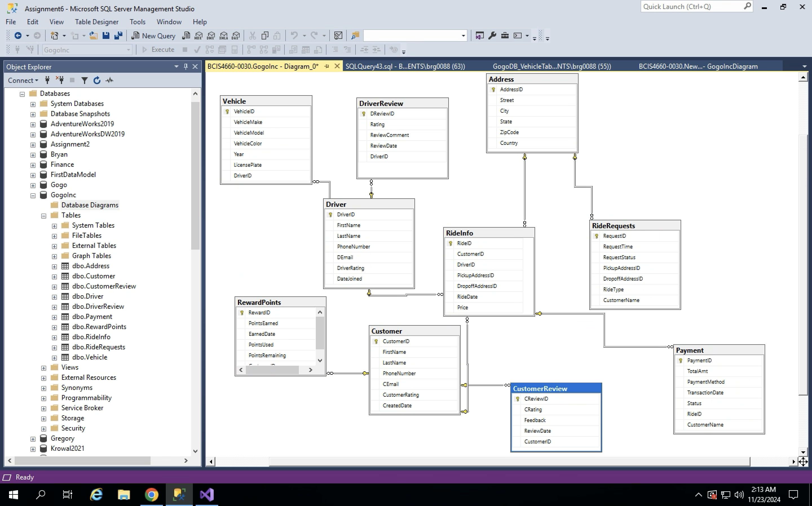
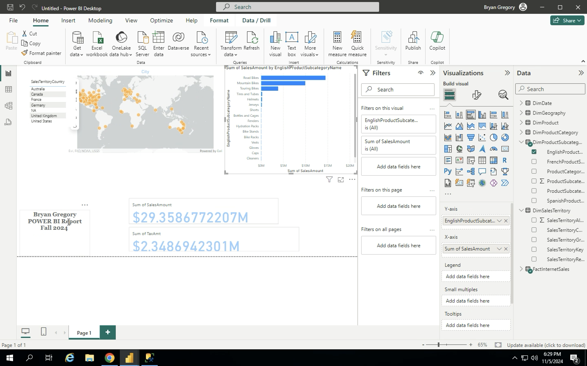
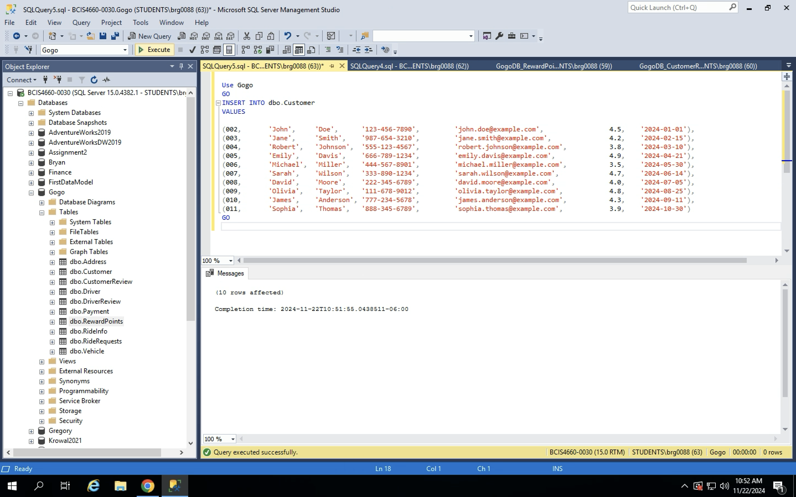

# 📦 Data-Warehousing-2024

This project demonstrates my understanding of data warehousing concepts, ETL workflows, dimensional modeling, and business reporting using Power BI.

---

## 📌 Project Overview

- Built a **star schema warehouse** from raw operational data  
- Designed **dimension and fact tables** to support business reporting  
- Developed an **ETL pipeline using SQL** to transform and load structured data  
- Created **ERDs and DW diagrams** to map data relationships  
- Built **Power BI dashboards** to visualize KPIs like sales and customer activity  

---

## 🧠 Skills Used

- SQL (`CREATE`, `INSERT`, `ALTER`, `UPDATE`)  
- ETL process  
- Power BI  
- ERD + DW schema design  
- SSMS (SQL Server Management Studio)  
- SSIS (SQL Server Integration Services)  
- SSRS (SQL Server Reporting Services)  

---

## 🖼️ Screenshots

### 🧱 ERD Diagram  
Visualizing table relationships in star schema  

### 📊 Power BI Dashboard  
Tracking KPIs and customer metrics  

### 📝 SQL Workflow Example  
Insert statements for staging/warehouse tables  

---

## 📂 File Structure
- `/screenshots/`: Visuals from ETL, Power BI, and schema diagrams, SQL scripts used to build and load warehouse
- `README.md`: Overview of project

---

## 🔗 About Me
- Bryan Gregory  
- [GitHub](https://github.com/BryanGregory01)  
- [LinkedIn](https://linkedin.com/in/bryan-gregory-a07087342)
